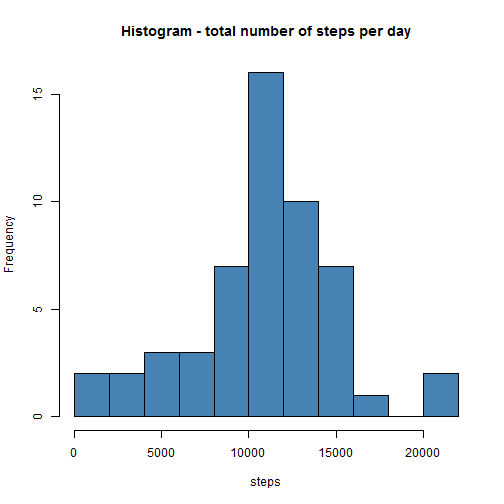
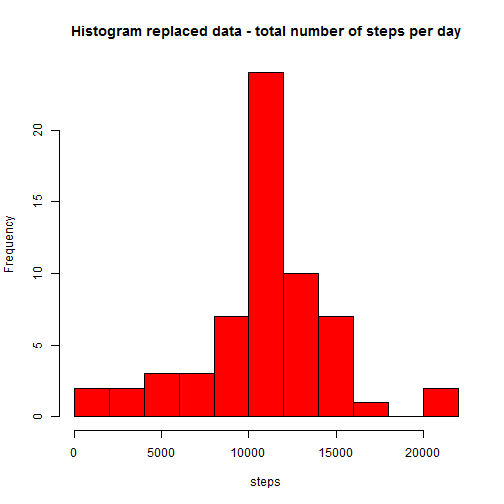

# Course 5 - Course Project 1

This assignment makes use of data from a personal activity monitoring device. This device collects data at 5 minute intervals through out the day. The data consists of two months of data from an anonymous individual collected during the months of October and November, 2012 and include the number of steps taken in 5 minute intervals each day.


## Loading and preprocessing data

This part contain the code for reading in the dataset and processing the data


```r
setwd("C:/Users/Willem/Documents/DATA_SCIENCE/000_Coursera/Course_5/Assignment1")
filename <- "./activity.csv"
md0 <- fread(filename)
md0$date <- as.Date(md0$date, "%Y-%m-%d")
md <- md0[complete.cases(md0),]
```

## Mean of total number of steps taken per day

The following code is developed to known what is mean total number of steps taken per day?


```r
totalsteps <- tapply(md$steps, md$date, sum)
hist(totalsteps, breaks = 10, main = "Histogram - total number of steps per day",
     xlab="steps", col = "steelblue")
```



```r
print(paste("The mean value is", round(mean(totalsteps),1), "steps per day"))
```

```
## [1] "The mean value is 10766.2 steps per day"
```

```r
print(paste("The median value is", median(totalsteps),"steps per day"))
```

```
## [1] "The median value is 10765 steps per day"
```

## Average daily activity pattern

The following figure allows us to know the average daily activity pattern. It is a time series plot of the 5-minute interval (x-axis) and the average number of steps taken averaged across all days (y-axis)


```r
dailypattern <- tapply(md$steps, md$interval, mean)
plot(dailypattern, type = "l", xlab = "5-minute interval",
     ylab = "average number of steps", 
     main = "Daily average activity pattern")
```


```r
print(paste("The 5-minute interval which contains the maximum number of steps is ", md$interval[which.max(dailypattern)]))
```

```
## [1] "The 5-minute interval which contains the maximum number of steps is  835"
```


## Imputing missing values

The presence of missing days may introduce bias into some calculations or summaries of the data. 

### Total number of missing values

```r
print(paste("the total number of missing values is", (sum(is.na(md0$steps)))))
```

```
## [1] "the total number of missing values is 2304"
```

### Filling in all of the missing values in the dataset

Missing values in the dataset will be replaced for the averaged number of
steps for that 5-minute interval

```r
md1 <- md0 ## setting the complete dataset
kk <- cbind(dailypattern, unique(md1$interval))
colnames(kk) <- c("average", "x.interval")
kk <- as.data.table(kk)

# Replacing the NA values for the averaged number of steps for that 5-minute
# interval
for (i in 1:nrow(md1)) {
      if (is.na(md1[i, steps])==TRUE) {
            md1[i, "steps"] <- round(kk[which(kk$x.interval == md1[i, interval]), average])
      }
} 
```

### Plotting new histogram of the total number of steps

```r
totalsteps1 <- tapply(md1$steps, md1$date, sum)
hist(totalsteps1, breaks = 10, main = "Histogram replaced data - total number of steps per day", xlab="steps", col = "red")
```



```r
print(paste("The new mean value is", round(mean(totalsteps1),1), ", before was", round(mean(totalsteps),1)))
```

```
## [1] "The new mean value is 10765.6 , before was 10766.2"
```

```r
print(paste("The new median value is", median(totalsteps1),", before was", median(totalsteps)))
```

```
## [1] "The new median value is 10762 , before was 10765"
```

Therefore, there is virtually no difference between removing the missing values and replce them.

## Differences in activity patterns

We are going to explore if there is any difference in activity patterns between weekdays and weekends.


```r
Sys.setlocale("LC_TIME", "English")
```

```
## [1] "English_United States.1252"
```

```r
# New factor variable
day <- as.factor(weekdays(md1$date) %in% c("Saturday", "Sunday"))
levels(day) <- c("weekday", "weeekend")
md1$weekdays <- day
md1.inter<-md1[,.(mean=mean(steps)), by =.(interval,weekdays)]

# Plotting the average number of steps versus the 5-minutes interval
g <- ggplot(md1.inter, aes(interval, mean))
p <- g + geom_line(aes(color = weekdays)) +
      facet_wrap( ~ weekdays, nrow=2, ncol=1) +
      labs (x = "5-minute interval") + 
      labs (y = expression ("Averaged number of steps")) +
      labs (title = "Activity patterns by day") +
      theme(plot.title = element_text(hjust = 0.5))
print(p)
```


